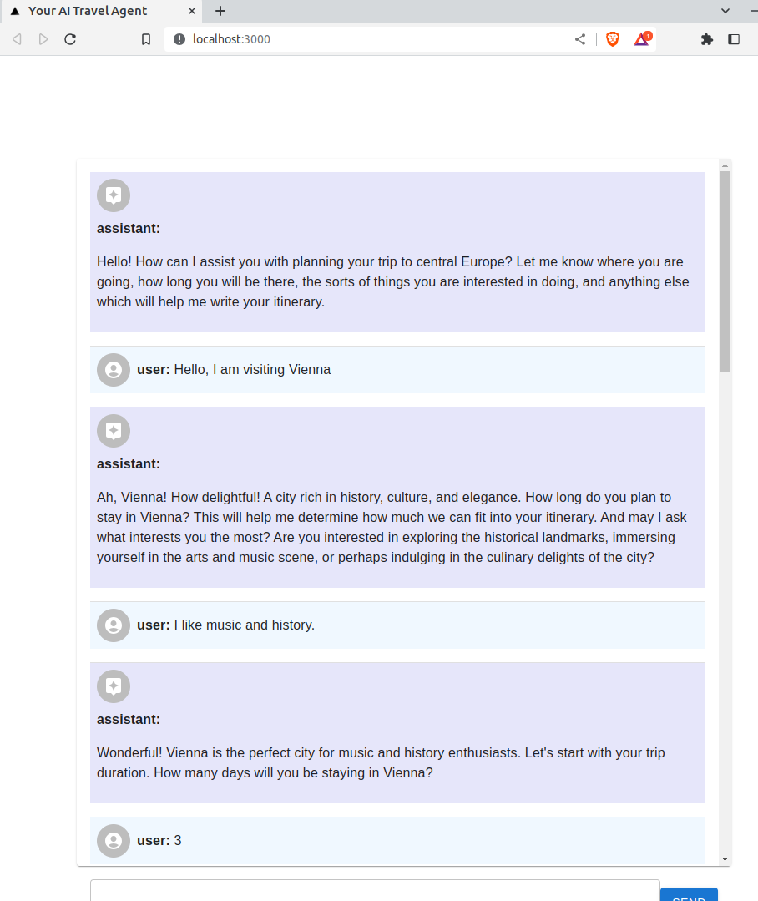
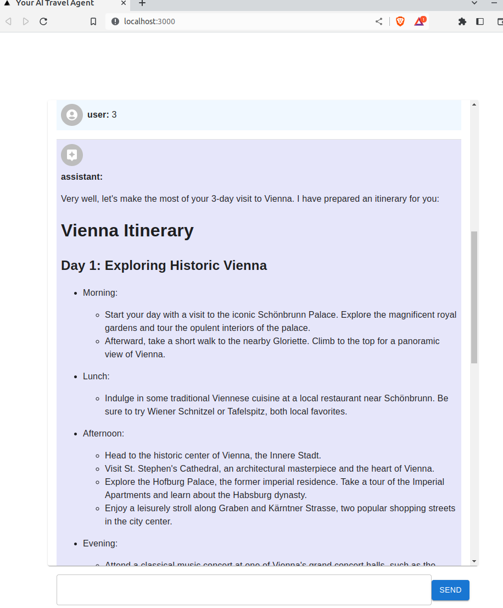

# AWS Serverless Generative AI Quick Start Guide
In this guide we will provide a relatively simple example of how to host a generative AI application on AWS using the OpenAI API. I pulled most of this UI code from my other side project: [MyChefAI.com](MyChefAI.com), which is an AI recipe writer. 

There are two main pieces to this repo, a frontend and a backend. The frontend uses NextJS, the backend uses FastAPI and Langchain. The Lambda utilizes the OpenAI API. 

NOTE: This repo is a work in progress. Right now it is only designed to be run locally, there is no IaC to deploy this anywhere.

**Features:**
* OpenAI API key stored locally
* Chat History for the current conversation maintained in UI
* UI will render markdown for better looking user interface
* Chat Prompt instructed to return travel itinerary in markdown

**ToDo:**
* Store chate history in a DB to be retrived later
* Allow user to create new prompts and store these in a DB
* Allow user to upload a file, generate embeddings, and chat with it (RAG)

## Overview of the demo application
The application is an AI Travel agent who will attempt to write a trip itinerary for you. Once the LLM has gotten enough info, it will attempt to write the itinerary in markdown. The UI will render this markdown in the chat window into a nice looking format.

Here is how it looks:




# Start with Docker-Compose
The easiest way to spin up this application is with docker compose. Just run the below command and docker will take care of the rest. Just make sure you have docker and docker-compose installed and running.

## 1) Prepare the Key
First, preparethe OpenAPI key. Create a file in the `backend` directory called `openai_api_key.txt`. This file is added in the .gitignore so it will not be commited if you clone this repo.

## 2) Start the Containers
Startup the frontend and backend containers. Docker Compose will automaticlly build these container on your system the first time you run this command. 
```
docker-compose up
```

The application will now be availbe at <http://localhost:3000>
You can also access the OpenAPI spec at <http://localhost:4000/docs>

# Running the Application without docker-compose

## Backend - Fast API, Langchain, OpenAI

### 1) Prepare the OpenAPI key
First, preparethe OpenAPI key. Create a file in the `backend` directory called `openai_api_key.txt`. This file is added in the .gitignore so it will not be commited if you clone this repo.


### 2) Statup the API
There are two ways to run the backend. if you'd like to run FastAPI without docker then follow these steps. 

Install prereqs
```
python3 -m venv .venv
source .venv/bin/activate
pip install -r backend/requirements.txt
```

Run the python script which starts the API, as shown below.
```
python backend/chat_api/fast_api.py 
```

Startup te API with SAM to mock API Gateway and lambda locally

```
# NOTE: Use port 4000 because the local UI runs on port 3000
sam build && sam local start-api --port 4000
```

## Frontend - NextJS
The frontend uses NextJS. 

*NOTE:* I have not yet written any deployment mechanism for the frontend, for now it only works on the local machine

### Prereqs
Ensure you have nodejs and npm installed

## Setup Steps
Leave your terminal with the backend up and running, open up a new terminal in the root of the repo to run the frontend

Install the needed deps for the frontend to run
```
cd frontend
npm install
```

## Run the frontend
```
npm run dev
```

You can now open the frontend at <http://localhost:3000>

# Now time to change up the prompt!

The initial prompt is maintained here in the ChatBot component of the frontend: [frontend/components/ChatBox.js](frontend/components/ChatBox.js) in the `initialMessages` variable. Change up the prompt however you wish. Maybe tell it to speak with a different accent, or tell the LLM it is a travel agent for Vienna, Virginia instead of Vienna, Austria.

There is no need to reload or rebuild. Simple make your alteration to the prompt, save the file, and you should see the localhost:3000 page will have refreshed, ready for you to start a new chat.

# Handling In-Context data (WIP)
Let's give the model access to data

Quote from OpenAI:

> Why search is better than fine-tuning  
GPT can learn knowledge in two ways:  
> 1) Via model weights (i.e., fine-tune the model on a training set)  
> 2) Via model inputs (i.e., insert the knowledge into an input message) <br><br>
Although fine-tuning can feel like the more natural option—training on data is how GPT learned all of its other knowledge, after all—we generally do not recommend it as a way to teach the model knowledge. Fine-tuning is better suited to teaching specialized tasks or styles, and is less reliable for factual recall.  

Source: https://github.com/openai/openai-cookbook/blob/main/examples/Question_answering_using_embeddings.ipynb


## Need some help or have an idea for an improvement?
Please feel free to ask questions or make PRs.
